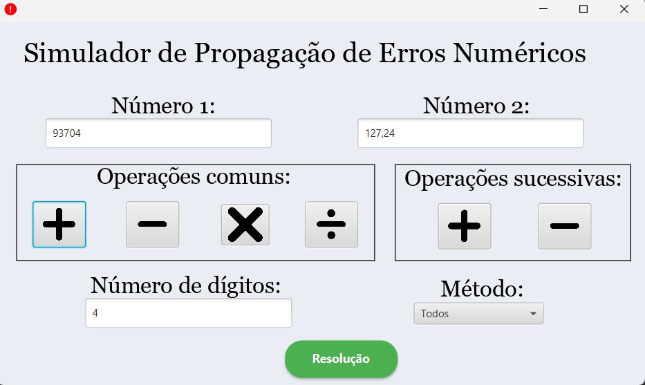
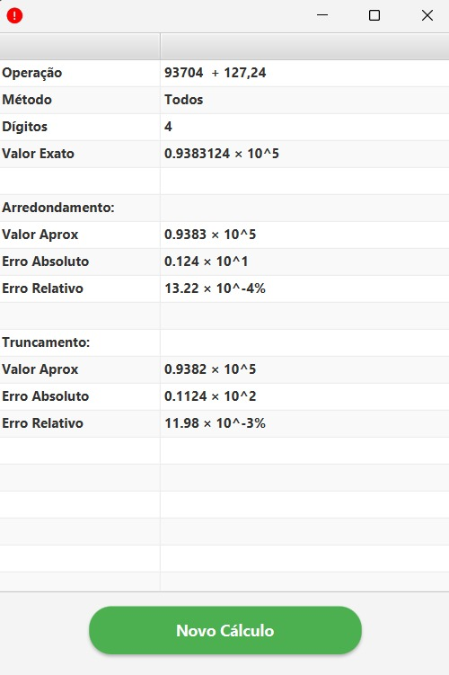

# ErrorSimulator

Este programa foi desenvolvido para a disciplina de **Cálculo Numérico 2025.2**.

## Objetivo

O objetivo principal do ErrorSimulator é demonstrar e explorar o conceito de erros numéricos que surgem devido à representação binária dos números em computadores. O programa permite visualizar, simular e analisar como operações matemáticas podem ser afetadas por limitações de precisão e arredondamento.

## Funcionalidades

- Simulação de operações matemáticas básicas (adição, subtração, multiplicação, divisão) e análise dos erros numéricos envolvidos.
- Visualização dos resultados e dos erros de arredondamento.
- Interface gráfica para facilitar a interação e compreensão dos conceitos.

## Screen Shots

## Como executar

O projeto utiliza Java e JavaFX. Certifique-se de ter o Java instalado e siga as instruções do seu ambiente para executar aplicações JavaFX. Também é disponibilizado um arquivo .jar, execute-o seguindo as instruções para a sua plataforma.
[Instruções para executar o programa](guia.md)

Desenvolvido para fins educacionais.
